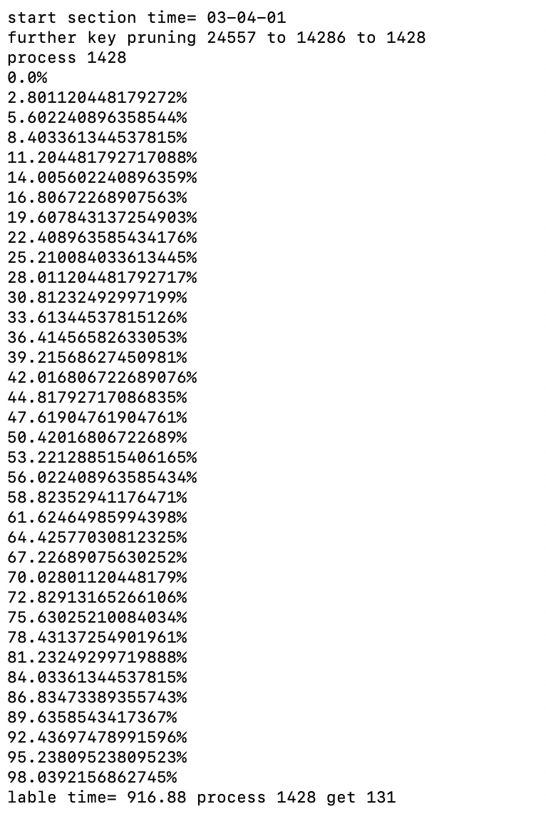
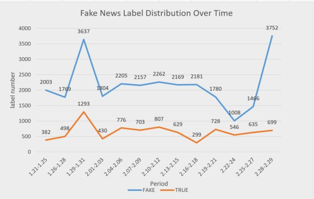
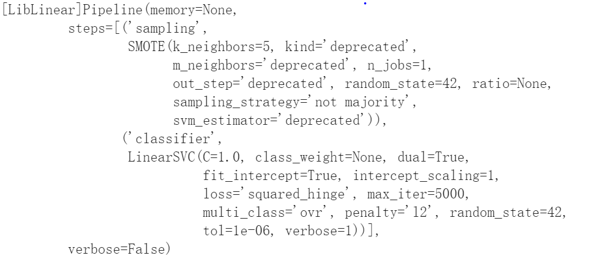
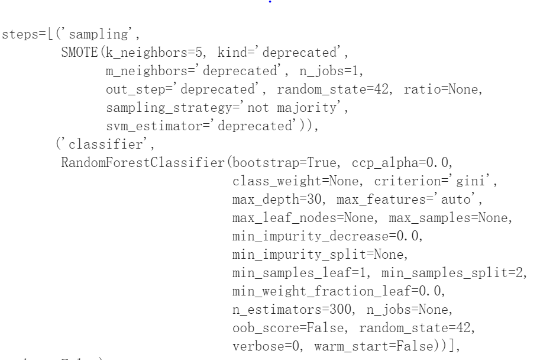
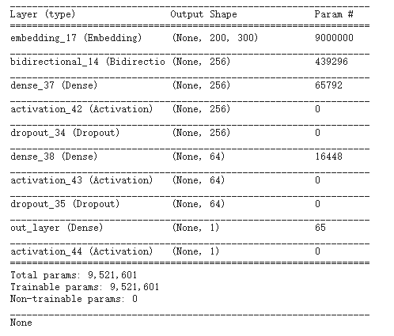
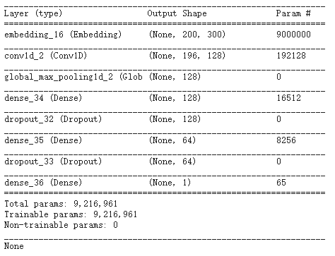
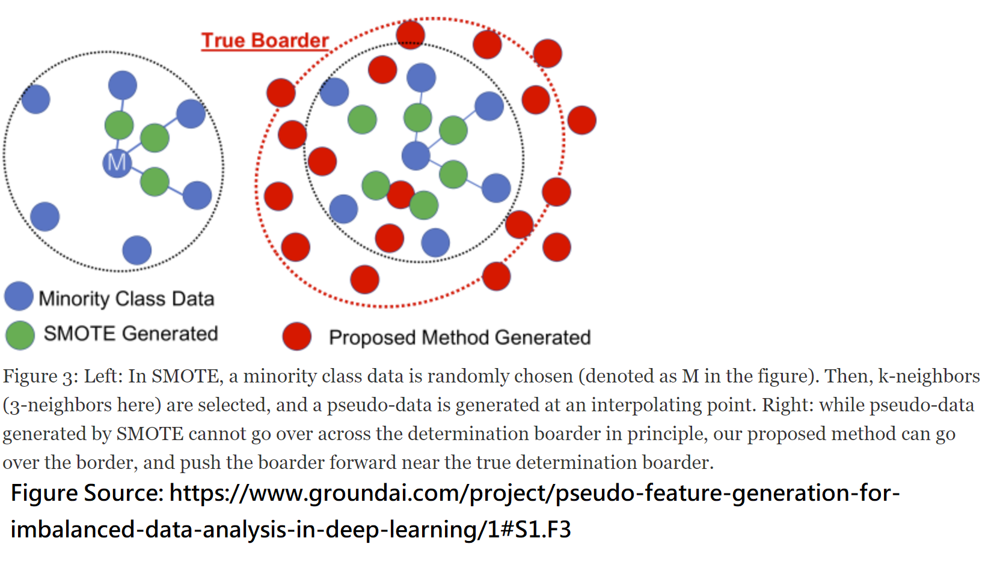
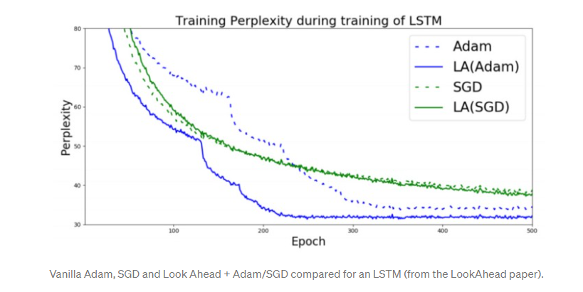
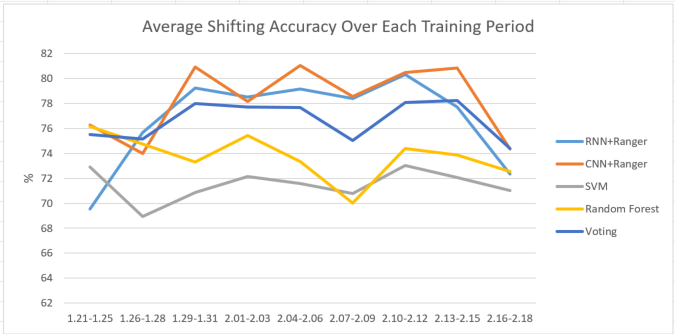
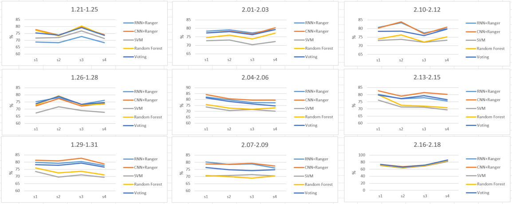

# A COVID Fake News War
*   ## COVID Fake News Data Is Always Drifting

Although many people read news online in social media nowaday, many people do not know they are under attack of fake news.

To understand how serious it is, we show the attacking trend of fake news  and find it higly related to current events. That is, this data is always drifting.


The current fake news is about COVID. We try to shows the changing wordclouds of the keywords in LDA topic models from 2020 Feb. to 2020 Nov from COVID related articles the factcheck website. We ring the words which indeeds show the hot topics at that moment.

Therefore, it is important for us to recognize them.

*   ### The ML models should be always updated to keep up with the drift. 
The main issue here is that the fake news mainly spreads in social media such as Twitter. The tweets on Twitter have three main problems that make fake news detection difficult.

*   The tweets contain many unstructed contexts such as tags, hashtags, emojis, stickers, emoticons, and other website links, which normally harm the detection performance.
*   The number of tweets is large, which requires the tweet collection and labeling process to be fast.
*   The topics of tweets are more messy and changing more swiftly than the factcheck website.
 


We do not ring the words as we cannot recognize any obvious topics in LDA topic models in our labeled tweets data.

*   ### Thus, we offer three solutions to the problems, respectively.

*   Data Cleaning
*   COVID Tweet Collection and Efficient Corroborative Labeling Process
*   General machine learning model deployment for varying data.

## Let us start to fight against the ultimate evil of COVID Fake News on Twitter!

*  ###   Data Cleaning

The raw tweets are not clear at all.

```
"😜 🤪 🤨 🧐 Coronaviris"
"RT @SKenson: As a gay man who came of age during the AIDS era of the 1980s, I\u2019m intensely curious for you, a Republican Senator, to tell me\u2026"
"@welt @kuku27 Jens Spahn: \"We took the corona virus very seriously from day one\"
"Hans de Boer (VNO-NCW): corona hakt fors in op economie | NOS https://t.co/zBTS0fRDSm"
```

We need to recognize the unstructed contexts and then clean them. 


1. **decode the tweets by HTML**
To see the most raw text features, we decide to decode the tweets by HTML (using python BeautifulSoup'lxml). This is because the tweets contain some punctuations with speicial presentation in collected data such as &quot=". 
2. **recognize tags and links**
The tags and url links will be useless for normal text analysis and machine learning models. Thus, we decide to remove it by regular expression.
3. **readable charaters uft-8 transformation**
The UTF-8 representation of the BOM is hexadecimal byte sequence. We need to convert it into readable charaters. Thus, we decode the text with ‘utf-8-sig’, which achieves this goal.
4. **Remove the hashtag, hashtags, emojis, stickers, and emoticons. Even digits**
The fake news detection should focus on the text. Thus, we use regular expression again to remove tokens other than alphabets and common punctuations such as [,?.].

After we complete all these steps, we convert the text to lowercase and refine the punctuation by removing some abnormal space.

```
"quarantine in united states diamondcruise american passengers. covid coronavirus"
"los alamos experts warn covid almost certainly cannot be contained, project up to. million dead"
"wtf is boosie? is that like the slime left behind a snail? not a fungus but not alive? not coronavirus. you ll get it."
``` 

*  ### COVID Tweet Collection and Efficient Corroborative Labeling Process

#### COVID Tweet Collection

The COVID Tweet data collection is done by TA. We still LDA models to find COVID realted three topics 150 keywords from the fact check websites. These keywords can be as our filters to the unrelated tweets without any of the keywords. 

```
ballot funding drug mail voter ad police voting fund budget tax nursing vote chloroquine hydroxychloroquine poll footage inmate payment dollar relief man prison support crime financial officer debt option faith muslim spending violence title million application package revenue payroll private proposal cut letter lawmaker stimulus enforcement safety increase polling legislation insurance unemployment white age county benefit employee healthy job student coverage outside colored payment essential hotel protection loan restaurant income adult layer color church cost food legal store kid mandate percent young covering wearer particle self short eviction gathering learning requirement center instruction attention room release leave cloth employer brain chinese lab travel cremation man clip alive lockdown ventilator funeral fatality mortality product supply bag woman quarantine british animal estimate message cause certificate equipment threat average capacity common droplet screenshot special influenza viral fear infected count outlet severe air bed factor site sign reporter billionaire daily body victim plastic fever
```

Then, we can focus on corroborative labeling process.

#### Efficient Corroborative Labeling Process

Even we have done tweet data leaning. The number of left tweets is large. The main tweets are thousands to tensands per hour after data cleaning.  The tweet texts are usually short and their context are messy. Thus, efficient corroborative labeling process is important. 

For efficiency, we assume that we can ramdom sample one of tenth tweets if our corroborative labeling process is strict and reliable. We can use part of the data to present the overall data. If the 10% data is insufficient (under 2500 tweets), we will random pick more data until we get 250 tweets. Thus, we send them into corroborative labeling process and accelerate the labeling process.

**The main spirit of the LITMUS standard project is to find a corroborative labeling process to labeling covid fake news**

**No high quality data we have; no good models we obtain**

Here, we introduce [Fact Check Tools API](https://developers.google.com/fact-check/tools/api). This API can let us check truth of the text by offering the evidence from fact check websites. 

You may think that we do not need to do our project as this api can replace our goals. However, this API seldom (under 5%) find the sources to verify the tweets. Even we use some sentence segmentation skills to check each sentence in a tweet. We can get about 10% tweets. That's why we need to build models to detect fake news when the API cannot find the sources.

**We get the average truth score of every tweet after we use some sentence segmentation skills to check each sentence in it.**
We get 1 point for each fake setence and get -1 point for each true sentence. We get 0 point for each unverified sentence or bad request from the API. In this way, we can use 0 as our threshold to define the truth of a tweet (positive: fake, negative:true, zero:discard).

The API will respond the verification results in 1~2 second per request. The labeling speed may not be enough to keep up with the upcoming data even if we do sampling and filtering.

**To accelerate the labeling process, we use multiprocessing pool with 4 processors. We will get bad requests from the API very often if we use more processors.**

The following figure is our typical labeling process, which shows that we can jus spend 916.88 seconds processing 1428 tweets and get 131 tweets' label.


Next, we can start to analyze our data and start deploying our machine learning models.

*  ### General Machine Learning Model Deployment

#### The imbalance data and machine learning model in fake news detection

we need to deal with the imbalance lableled data before we deploy our machine learning models.



The above figure shows **the number of fake news is always larger than true news** in twitter in each period (3 days as one and we adjust it due to the start and end of months) from 1.21 to 2.29. 

**This trend is not surprising as the true news are not the main target that fake check websites check. These websites primarily fight against the spreads of fake news. The true news are labeled as they should avoid being recognized as fake news.** Other personal tweets are not important in the war between true news or fake news. However, we may needs to develop a model to detect whether a tweet is controversial. That is, we need to decide whether a tweet is just a personal daily tweet outside the fake news war. The user may use our service to decide whether his or her friends' personal tweets are true or not. We should stop them to do this. However, how to automatically label personal daily tweets will be another big challenge; thus, we put it in the future work.  **Now, we pay attention to the machine learning models. We should adopt some strategies to make the models to not just guess the majority class (fake news).**
 
As a result, our task is to recognize fake news while to avoid mistaking true one as fake one as much as we can. 
**We demonstrate our found reasonable architectures of our models and do not change them in our experiments. In doing so, the unchanged architectures let our model deployment will be more automatically. They just need to be efficiently trained on new data periodically to detect faje bews**

####  Traditional Machine Learning Models

We leverage support vector machine (SVM) and random forest (RF) as our traditional machine learning models, which are based on general decision boundaries.

**Here are traditional learning model hyperparameters and SMOTE sampling methods (desribed in later sections)**

**SVM**



**RF**



#### Deep Learning Model

We also adopt a long short time memory, an artificial recurrent neural network (RNN) architecture, and a one-dimension convulution nerual network (CNN) as our deep learning models, which are common natural language procession models for fake news detection.

**Here are deep learning model architectures and their corresponding number of parameters**

**RNN**



**CNN**




**To achieve this goal, we have two strategies.**

1. We sample data to balance the distribution in a reasonable way before we train the traditional machine learning models on them.
2. We should optimize the deep learning models with "memory". That is, our optimizer should lookahead the previous optimizing steps to better plan the future optimization. In doing so, the model can avoid overfit local data distribution in some optimization steps. 

#### Oversampling Data: SMOTE: Synthetic Minority Over-sampling Technique.
Nitesh V. Chawla  proposed SMOTE: Synthetic Minority Over-sampling Technique, which help us synthesize the reasonable new data points among the minority class (true news) data points. In this way, we can balance the distribution a little bit. We adopt the methods for support vector machine and random forest as these models more tend to find the general decision boundaries in feature space than deep learning models.

The following figure is a good explanation of SMOTE.


#### New Deep Learning Optimizer, Ranger: Synergistic combination of RAdam + LookAhead for the best of both.
RAdam (Rectified Adam) and LookAhead are two different approaches to optimize deep learning models. RAdam adopts a dynamic rectifier based on the previous variance to adjust momentum of Adam optimizaer. Its automatic warm-up strategies ensures a solid start to training based on its training dataset. LookAhead provides a robust and stable exploration by memorizing previous optimization steps during the entirety of training.

The following figure is the performance of lookahead methods from Lookahead paper.  



### Our performance results



